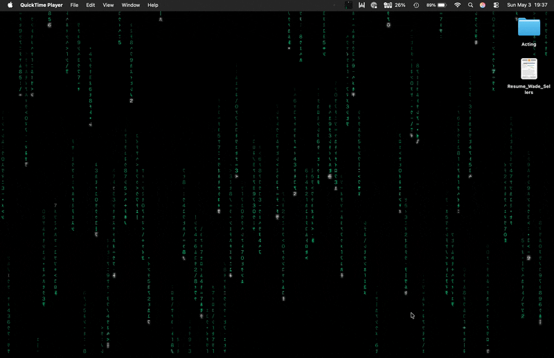

# Falling Code

A standalone macOS app that brings the digital rain from *The Matrix* (1999) to your desktop, your lock screen, your menu bar, and an on-demand fullscreen takeover.



Built in Swift + Metal for macOS 14+ (Sequoia / Tahoe) on Apple Silicon. Mirrored half-width katakana flowing in green columns down a black screen, white-green leading characters, fading green trails, occasional stammer flickers, soft bloom on the heads, CRT scanlines and vignette. Five color themes, live previews, and a global hotkey to summon it from any app.

> The visual is inspired by the iconic 1999 cypherpunk film — Falling Code is an unaffiliated, unofficial fan project. *The Matrix* and related marks are trademarks of Warner Bros. Entertainment Inc.

## Features

- **Fullscreen takeover** — covers every connected display, dismisses on any input
- **Live desktop wallpaper** — animated rain behind your icons (optional)
- **Lock-screen still** — sub-option of wallpaper; installs a per-screen still as your system wallpaper so the lock screen matches your current theme
- **Global hotkey** — `⌃⌥⌘M` from anywhere toggles fullscreen rain without taking focus from your other apps
- **Auto-activate on idle** — full screensaver-replacement behavior with a configurable threshold
- **Animated menu-bar icon** — a tiny live render in your current theme that animates 24/7
- **Themed popover menu** — left-click the icon to open it; the popover background is itself live rain in your theme
- **Five themes** — Classic, Crimson, Amber CRT, Sepia, Solarized
- **Touch ID dismiss** — tap the Touch ID button (or `⌃⌘Q`) and Falling Code tears itself down behind the lock screen, so finger-unlock lands you on a clean desktop

## Install

Requires macOS 14+ (Sequoia / Tahoe) and Apple Silicon. Build from source:

```bash
brew install xcodegen
git clone https://github.com/WadeSellers/matrix-screensaver.git
cd matrix-screensaver
./scripts/install-app.sh
```

The script regenerates the Xcode project, builds Release, ad-hoc codesigns, and installs to `/Applications/Falling Code.app`. Launch it and the icon appears in your menu bar. (No Dock icon — `LSUIElement` is set so it stays out of the way.)

### Gatekeeper note

The first time you launch you may see "Falling Code can't be opened" — the bundle is ad-hoc signed, not notarized. **System Settings → Privacy & Security → Open Anyway**.

## Usage

| Action | How |
| --- | --- |
| Open the popover menu | **Left-click** the menu-bar icon |
| Toggle fullscreen rain | **Right-click** (or **control-click**) the icon — the easter-egg shortcut |
| Toggle from anywhere | **⌃⌥⌘M** (works in any app, even fullscreen) |
| Open Preferences | **Left-click → Preferences…** |
| Dismiss fullscreen | Any mouse move, click, scroll, key press, gesture |
| Dismiss to a clean desktop | Touch ID tap or `⌃⌘Q` (locks → Falling Code tears down behind the lock screen → fingerprint-unlock lands on plain desktop) |

`fallingcode://` URL scheme is also wired up: `fallingcode://activate`, `fallingcode://dismiss`, `fallingcode://toggle`, `fallingcode://preferences`. Useful for Raycast, Alfred, Stream Deck, AppleScript, Hammerspoon — anything that can open a URL.

## Configure

Open Preferences from the popover. The form sits over a live preview that updates as you change settings.

**Rendering**
- **Theme** — gallery of color presets, click a tile to switch
- **Speed** — global multiplier from 0.25× to 3.0×

**Desktop**
- **Use Falling Code as desktop wallpaper** — live animated rain behind your icons. Pauses while a fullscreen session is active so the GPU isn't rendering twice.
- **Also show on lock screen** — sub-option; installs a per-screen still as the system wallpaper so the lock screen shows the rain in your current theme. Captures your previous wallpaper on first install and restores it on toggle-off.

**Activation**
- **Toggle anywhere** — the global hotkey (display-only for now)
- **Activate when idle** — auto-fire after the threshold
- **Idle threshold** — 1–30 minutes

Settings persist in `UserDefaults`. Theme is keyed by name so reordering presets doesn't lose your selection.

## Architecture

```
MatrixCore (framework)
├─ MatrixRenderer       Metal renderer — column pass + bloom + CRT composite
├─ GlyphAtlas           2048×2048 R8 atlas built once via CoreText
├─ Shaders.metal        Fullscreen-triangle column shader, bloom, composite
├─ BloomPipeline        Half-res ping-pong, two-pass separable Gaussian
├─ MatrixTheme          Color triplets + per-theme bloom/CRT multipliers
├─ MatrixSettings       Speed, theme, etc. — persisted via UserDefaults
└─ MatrixLayerHost      CAMetalLayer + display link, used by every host

MatrixApp (the app — produces Falling Code.app)
├─ AppDelegate          Wires the singletons: session, idle monitor,
│                       wallpaper manager, system wallpaper, hotkey, menu
├─ MatrixSession        Fullscreen activation state machine (1 window /
│                       NSScreen, dismiss-on-input monitor, screen-lock
│                       observer)
├─ MatrixWindow         Borderless screensaver-level NSWindow per display
├─ MatrixWallpaperWindow Borderless desktop-level NSWindow per display
├─ MatrixWallpaperManager Per-screen wallpaper window lifecycle
├─ SystemWallpaperManager Renders a per-screen still and installs
│                       it via NSWorkspace.setDesktopImageURL
├─ IdleMonitor          NSEvent global monitors → idle detection
├─ GlobalHotKeyManager  Carbon RegisterEventHotKey for ⌃⌥⌘M
├─ MenuBarItem          NSStatusItem with a programmatically rendered
│                       animated icon (10fps CGContext draws)
├─ MenuPopover          Custom NSPopover with live render behind
│                       SwiftUI menu rows
└─ SettingsWindowController SwiftUI settings form sitting over a live
                        preview
```

The internal Swift class names retained the `Matrix*` prefix from the project's original codename — they're implementation detail nobody sees. Only the user-facing identity is Falling Code.

### Render pipeline

```
columns ──► sceneTexture ──► [extract] ──► [blur H] ──► [blur V] ──► [composite + CRT] ──► drawable
                                       ╲                           ╱
                                        bloomA / bloomB (half-res ping-pong)
```

- **Column shader** (`fragment_columns`): one fullscreen-triangle pass. Per fragment, derives `(col, row)` from pixel coords, looks up the column's `headRow` from a per-column buffer, computes `trailDist = headRow - row`, emits color from a per-theme piecewise gradient (head → near-trail → mid-trail → far-trail → black). Per-cell glyph index is `hash3(col, row, seed ^ frameBucket) mod glyphCount`.
- **Glyph atlas**: built once at startup. Mirrored half-width katakana + Latin digits + symbols, rendered via CoreText + Hiragino Sans into a flipped CGContext. Mirroring is what produces the iconic "alien" digital-rain look.
- **Bloom** (`BloomPipeline`): half-resolution ping-pong. Threshold extract pulls only pixels above a luminance cutoff so heads bloom but trails don't smear. Two-pass separable 9-tap Gaussian. Composite adds at theme-driven strength.
- **CRT post-process**: bundled into `fragment_bloom_composite` as a uniform-driven optional path. Crisp every-N-pixel scanlines, radial vignette.
- **Per-screen state is automatic** — every host (fullscreen, wallpaper, settings preview, popover preview) creates its own `MatrixRenderer` instance. No shared mutable state.

### Why standalone app instead of a `.saver` bundle?

The original goal was a System Settings → Screen Saver bundle. It hit two unsolvable Tahoe-era bugs in `legacyScreenSaver`'s window management:

- Multi-display: `legacyScreenSaver` instantiated `ScreenSaverView`s for secondary displays at coordinates that didn't intersect any `NSScreen`, so frames never reached the panel. Workarounds were silently reverted by the framework — the OS owns window placement here and ignores plugins.
- Intermittent black screen: the framework would sometimes spawn 2–3 `ScreenSaverView` instances per activation with one or two mounted in zero-size windows, and macOS would arbitrarily pick which to display.

Apple's own savers use a separate `.appex` Screen Saver Extension API that isn't exposed to third parties on Sequoia/Tahoe. Rather than fight the legacy framework, this project pivoted to a standalone menu-bar app that uses its own `NSWindow`s at `.screenSaver` window level — same visual outcome, none of the framework bugs. The deprecated `MatrixSaver/` bundle is still in the repo as a cautionary tale but isn't built or installed by the app script.

## Visual reference

Color stops, fall speed, glyph swap rate, and trail length come from [carlnewton's frame analysis](https://carlnewton.github.io/digital-rain-analysis/) and the defaults in [Rezmason/matrix](https://github.com/Rezmason/matrix). The film itself has no published spec.

## License

TBD. The code is yours to read; the Hiragino Sans font is shipped with macOS and used at runtime via Core Text (no font is bundled in this repo).
