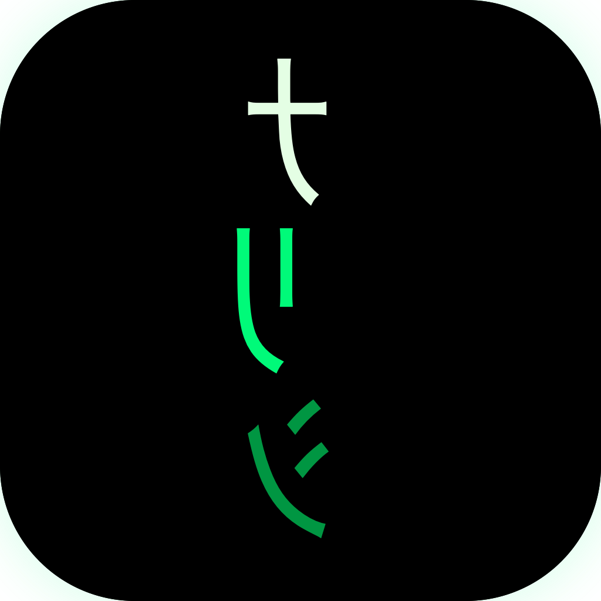

  

<h1 align="center">Falling Code — FAQ</h1>

<i>Quick answers to the questions people ask most.</i>

---

## Contents

- [Performance & battery](#performance--battery)
- [Setup & display](#setup--display)
- [Behavior & usage](#behavior--usage)
- [Purchase, support & source](#purchase-support--source)

---

## Performance & battery

<strong>Will Falling Code slow down my Mac?</strong>

No. It's built in Swift + Metal, native to Apple Silicon, and renders
at 60fps using a tiny amount of GPU. It's designed to run all day
without affecting battery life or performance.

<strong>Will the live wallpaper drain my laptop battery?</strong>

On a desktop or plugged-in laptop, no. On battery, the renderer
automatically reduces frame rate and bloom quality to save power. You
can also turn the live wallpaper off in Preferences if you only want
the menu-bar features.

---

## Setup & display

<strong>Does it work with multiple monitors?</strong>

Yes — automatically. The rain renders on every connected display at
the right resolution and DPI. Plug or unplug a monitor and it adapts.

<strong>How do I make Falling Code launch at startup?</strong>

System Settings → General → Login Items → click `+` → choose Falling
Code from `/Applications`. Then it'll start every time you log in.

<strong>How do I uninstall Falling Code?</strong>

Drag Falling Code from `/Applications` to the Trash. Your settings
and any installed lock-screen wallpaper are cleaned up automatically
when macOS removes the app's sandbox container.

---

## Behavior & usage

<strong>Why doesn't Falling Code appear in the Dock?</strong>

It's a menu-bar app by design — no Dock icon to keep your workspace
clean. Click the green glyph in your menu bar to access everything,
or use <kbd>⌃</kbd><kbd>⌥</kbd><kbd>⌘</kbd><kbd>M</kbd> to summon
fullscreen rain from anywhere.

<strong>My fullscreen rain is being dismissed too easily. Can I make it stay longer?</strong>

Fullscreen mode is intentionally dismissed by any input (mouse,
scroll, keypress) — it's meant to be a quick atmospheric moment, not
a persistent state. For an always-on look, use the live wallpaper
feature instead.

---

## Purchase, support & source

<strong>Can I use this on multiple Macs with one purchase?</strong>

Yes. Falling Code is part of Apple's Family Sharing program — once
you've purchased it, anyone in your Family Sharing group can install
it on their devices. You can also use it across all your own Macs
signed into the same Apple Account.

<strong>How do I report a bug or request a feature?</strong>

Use the **Send Feedback** button on the Support tab in Preferences.
It opens a quick form that creates a tracked issue with Wade directly.

<strong>Is the source code available?</strong>

Yes — Falling Code is open source. The repo lives at
<https://github.com/WadeSellers/matrix-screensaver>. You can read
the code, file issues, and even contribute PRs if you like.

---

  <strong>Still stuck?</strong> 
  Tap <b>Send Feedback</b> on the Support tab in Preferences — it goes straight to Wade.

